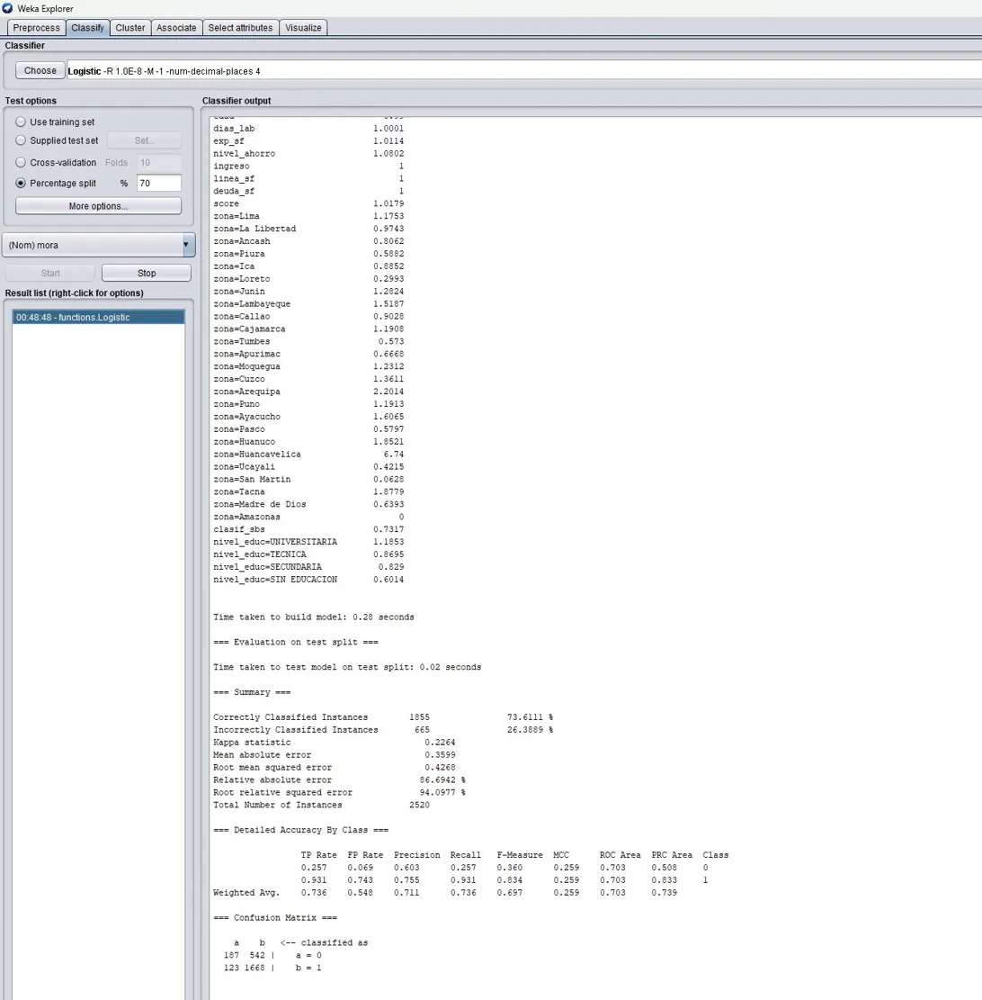
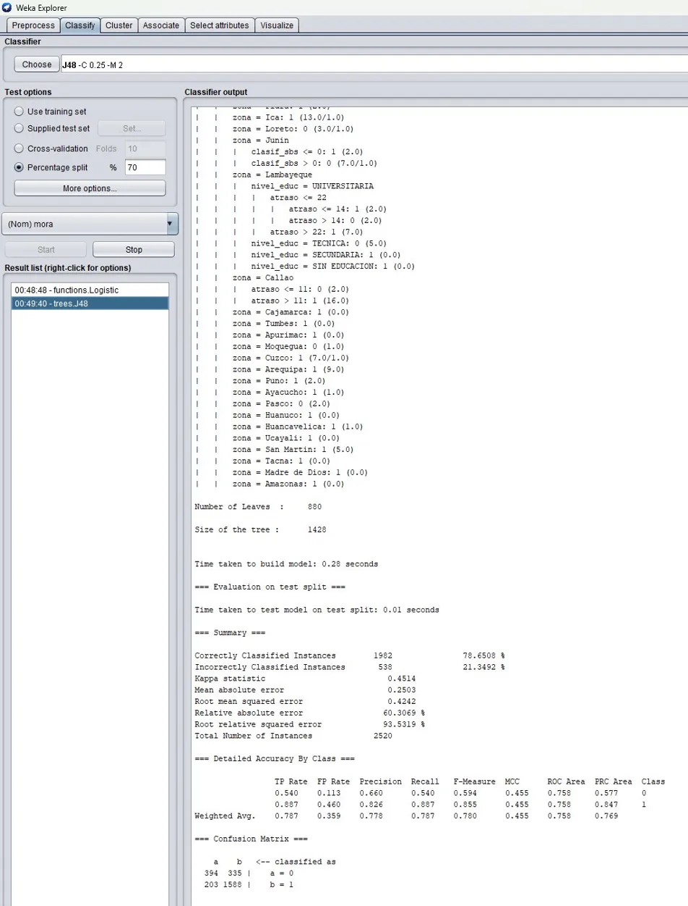
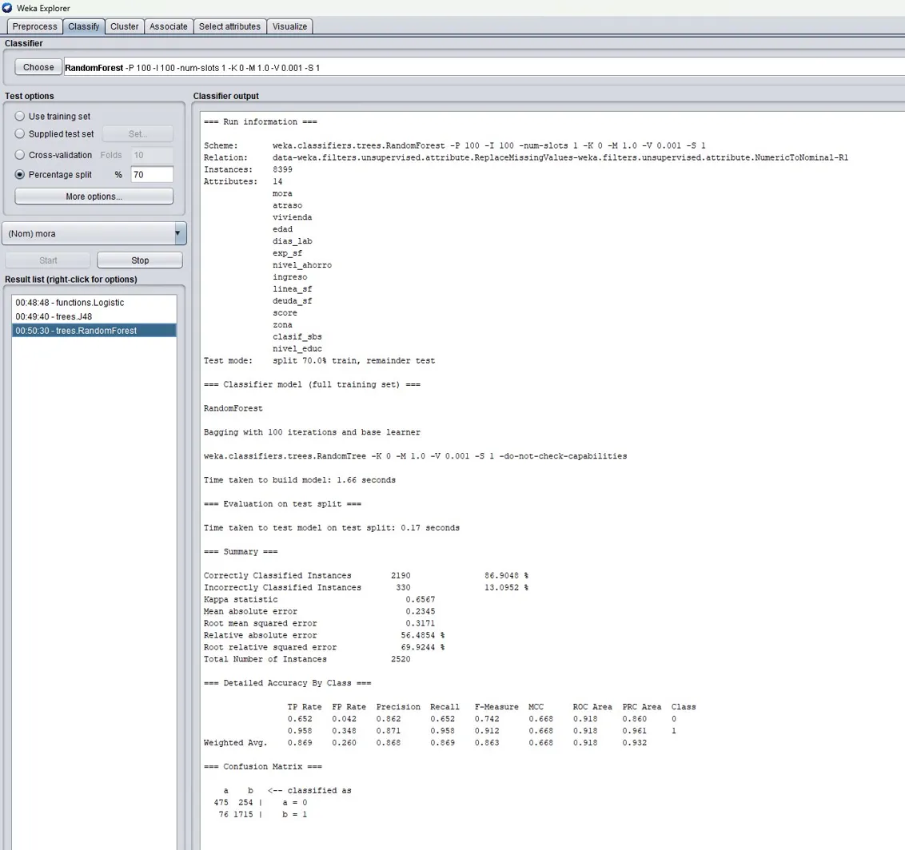
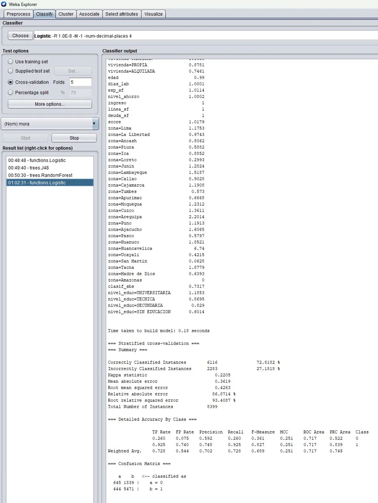
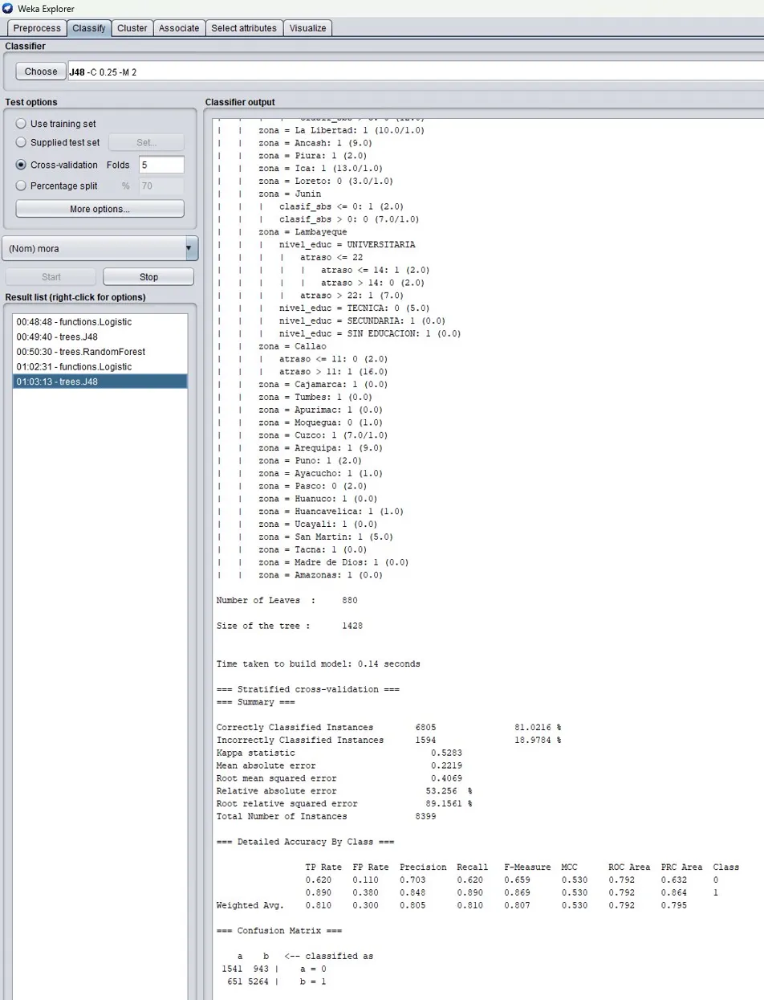
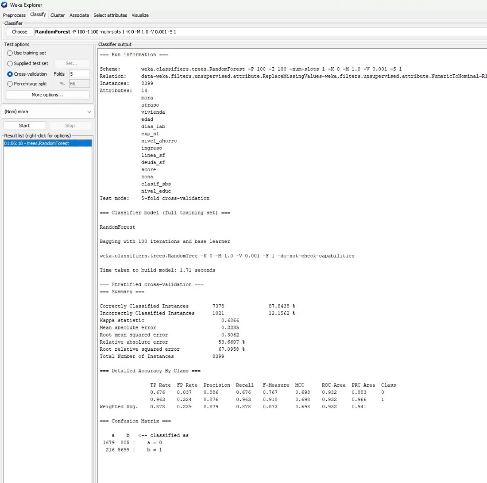
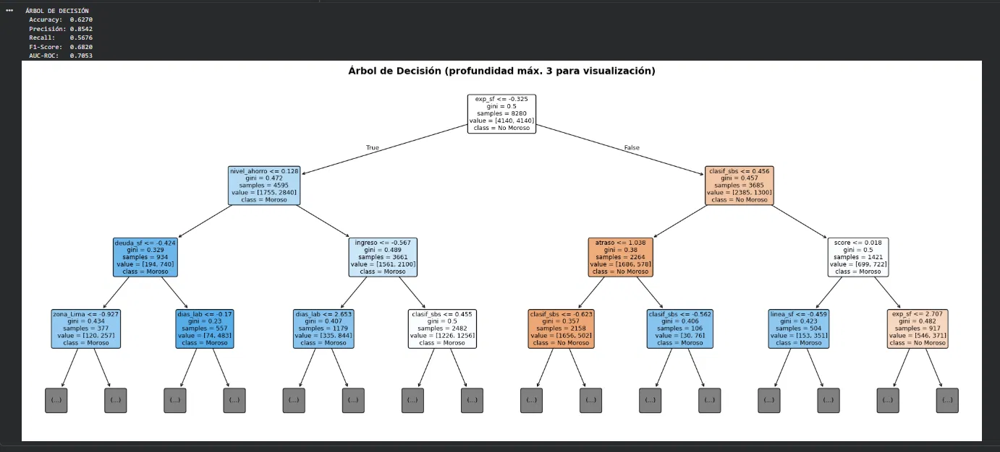
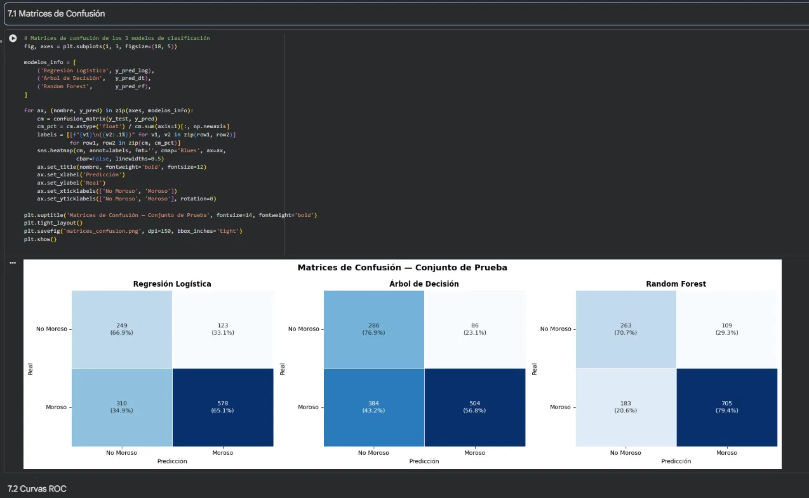
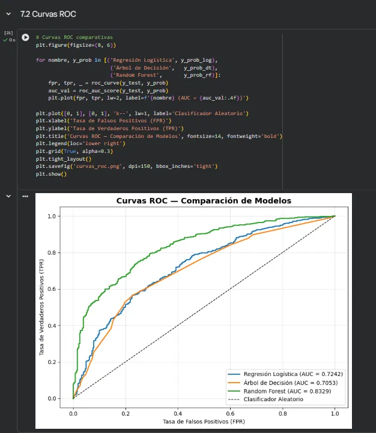

# Galería de Resultados

Este documento reúne las capturas de resultados obtenidas en **Weka** y los gráficos generados en **Google Colab**, con la explicación de cada uno. Complementa el informe técnico (`informe.pdf`) y evidencia el desempeño de los modelos de predicción de morosidad.

---

## 1. Resultados en Weka

Se ejecutaron tres clasificadores (Regresión Logística, J48 y Random Forest) bajo dos métodos de evaluación: **Percentage Split 70%** y **Cross-Validation 5-fold**. En todos los escenarios, Random Forest obtiene el mejor desempeño.

### 1.1 Percentage Split 70%

#### Regresión Logística

Modelo base. Clasifica correctamente el **73.61%** de las instancias (1855/2520), con un Kappa de 0.2264. Presenta buen recall para la clase morosa (0.931) pero precisión moderada, lo que refleja su tendencia a marcar clientes como morosos.

#### Árbol de Decisión (J48)

Árbol con 880 hojas y tamaño 1428. Mejora a la regresión logística con **78.65%** de instancias correctas (1982/2520) y un Kappa de 0.4514. Ofrece reglas de decisión interpretables (por zona, nivel educativo, atraso, etc.).

#### Random Forest

Modelo ganador. Alcanza **86.90%** de instancias correctas (2190/2520), Kappa 0.6567 y ROC Area 0.918. La matriz de confusión muestra 475 verdaderos negativos y 1715 verdaderos positivos.

### 1.2 Cross-Validation 5-fold

#### Regresión Logística

Con validación cruzada estratificada, clasifica correctamente el **72.82%** (6116/8399), Kappa 0.2205. Resultado consistente con el obtenido por Percentage Split.

#### Árbol de Decisión (J48)

Obtiene **81.02%** de instancias correctas (6805/8399) y Kappa 0.5283, confirmando su estabilidad como alternativa interpretable.

#### Random Forest

Mejor resultado global: **87.84%** de instancias correctas (7378/8399), Kappa 0.6866, ROC Area 0.932 y recall de 0.963 para la clase morosa. La matriz de confusión evidencia solo 216 falsos negativos, minimizando el error más costoso financieramente.

---

## 2. Gráficos generados en Google Colab

### 2.1 Árbol de Decisión

Visualización del árbol (profundidad máxima 3 para lectura). Las primeras divisiones se realizan sobre `exp_sf` (experiencia en el sistema financiero), `nivel_ahorro` y `clasif_sbs`, coincidiendo con las variables más importantes del modelo. Métricas de este modelo: Accuracy 0.6270, F1-Score 0.6820, AUC-ROC 0.7053.

### 2.2 Matrices de Confusión

Comparación de los tres modelos sobre el conjunto de prueba. Random Forest logra la mejor combinación: 70.7% de no morosos y 79.4% de morosos correctamente clasificados, superando a la Regresión Logística y al Árbol de Decisión.

### 2.3 Curvas ROC

Curvas ROC comparativas. Random Forest (AUC = 0.8329) domina sobre la Regresión Logística (0.7242) y el Árbol de Decisión (0.7053), confirmando su mayor capacidad discriminatoria entre clientes morosos y no morosos.

---

## Conclusión

Los resultados son consistentes entre ambas herramientas (Weka y Google Colab) y bajo ambos métodos de evaluación. **Random Forest** se confirma como el modelo ganador, superando los objetivos planteados en el proyecto (Accuracy mínima 75%, AUC-ROC mínimo 0.80).

> **Nota:** Las diferencias de porcentaje entre Colab y Weka se deben a que Colab aplica la técnica **SMOTE** (balanceo de clases) sobre el conjunto de entrenamiento, mientras que Weka trabaja con el dataset original más los filtros `ReplaceMissingValues` y `NumericToNominal`.
